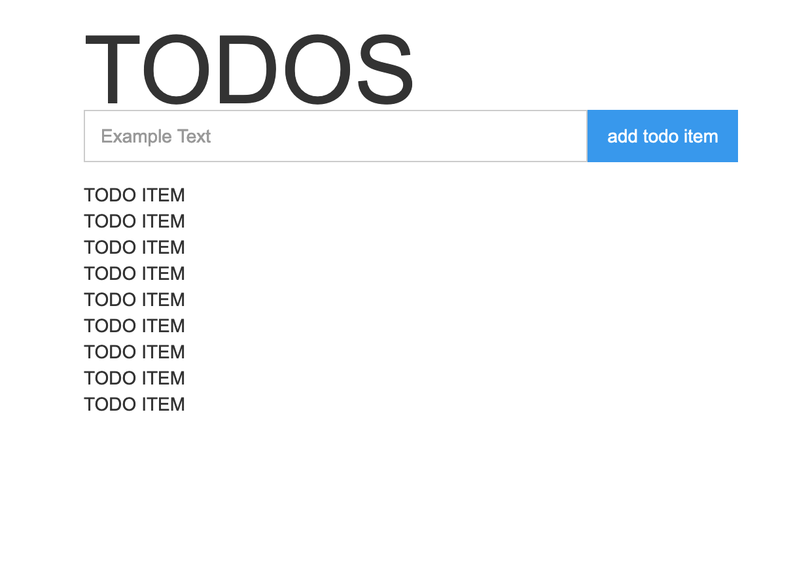

This tool enables you to convert Webflow sites into components that you can use in React apps. It works by scanning published sites for elements with a `data-component-name` attribute, then compiles those elements as React code that you can attach custom logic to. Take this TODO app for example:



This can be compiled & included as React code like so:

```javascript
import {Application as BaseApplication, TodoItem as BaseTodoItem} from './views/stable/sprite.html';
import * as React from 'react';

class TodoItem extends React.Component {
  render() {
    const {label} = this.props;
    return <BaseTodoItem labelProps={{
      label,
    }} />
  }
}

class Application extends React.Component {
  state = {
    items: [
      {
        label: 'take out trash'
      }, 
      {
        label: 'walk dog'
      }
    ]
  };
  render() {
    const {items} = this.state;
    const todoItems = items.map((item, i) => {
      return <TodoItem key={i} label={item} />;
    });
    return <BaseApplication
      items={todoItems}
    />;
  }
}
```

Which produces this:

[TODO GIF]

#### Examples

- TODO example source code

#### Getting Started

To get started, you'll need to add information to your site. Here's a basic example site that you can lo

TODO

#### Caveats

There are some limitations to this tooling that you should be aware of:

- Interactions are not compiled.
- Built-in Webflow components are not compiled (Dropdown, E-commerce, Slider). 
- Dynamic CMS bindings are not compiled.
