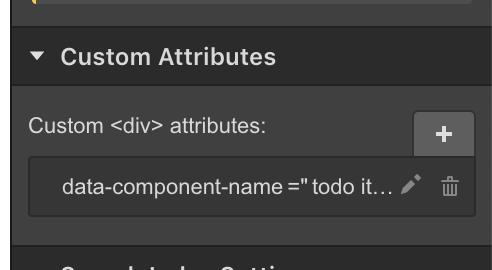

> This tool is experimental, so I don't suggest you use it in a production application. 

**Installation**: `npm install webflow-componentizer --save-dev` or `yarn add webflow-componentizer --dev` 

This tool enables you to convert Webflow sites into React components. It works scanning vanilla HTML for `data-*` attributes that contain information like component names, and slots, then uses that data to generate _basic_ components that you can add custom behavior to. For example, assuming you have a website with the HTML source:

```html
<div data-component-name="Hello world">
  Hello <span data-slot="message">world</span>!
</div>
```

You can download the website & include it in a React app like so:

```javascript
import * as React from "react";
import {BaseHelloWorld} from "./views/stable/sprite.html";

class HelloWorld extends React.Component {
  render() {
    return <BaseHelloWorld message="blaaargg" />
  }
}
```

☝️Attaching this to the DOM should display `Hello blaaargg!`.

#### Examples

- [TODO Application](./examples/todos)

#### Config 

You'll need to define a `webflow-componentizer.config.js` file in your root project directory. Here's a basic config you can use:

```javascript
module.exports = {

  // the source website
  sourceUrl: "http://craigs-first-project-96a7ec.webflow.io/",

  // the directory where views are downloaded to
  directory: __dirname + "/src/views",

  // the framework to compile to (React currently only supported)
  framework: "react",

  // The stable version of your website (symlinks to views/stable)
  stableVersion: "1.0.1"
};
```


#### CLI usage

```
Usage: webflow-componentizer [options] [command]

Options:
  -V, --version           output the version number
  -V, --version           output the version number
  -h, --help              output usage information

Commands:
  pull                    Downloads current website
  build:typed-definition  Builds typed definition file for all versions
```

Here's some basic `package.json` scripts you can use in your project:

```json
"scripts": {
  "sync": "webflow-componentizer pull",
  "build": "webpack",
  "build:typed-definition": "webflow-componentizer build:typed-definition"
}
```

- `npm run sync` downloads the website into the views/[VERSION] directory. `VERSION` is based on the [data-version](#data-version) attribute found in your body element.

#### Using in code

TODO

#### Caveats

There are some limitations to this tooling that you should be aware of:

- Interactions are not compiled.
- Built-in Webflow components are not compiled (Dropdown, E-commerce, Slider). 
- Dynamic CMS bindings are not compiled.


## Syntax

There are certain attributes you can use to change how elements are compiled. They can be added in the custom attributes pane.



#### data-version

This is an optional property you can define on your `body` element. It enables you to keep multiple versions of a website locally when calling `webflow-componentizer pull`. 

#### data-component-name

Flags an element as a component. For example, `data-component-name="todo app"` would be compiled as `BaseTodoApp`. 

#### data-name

TODO

### data-slot

TODO

